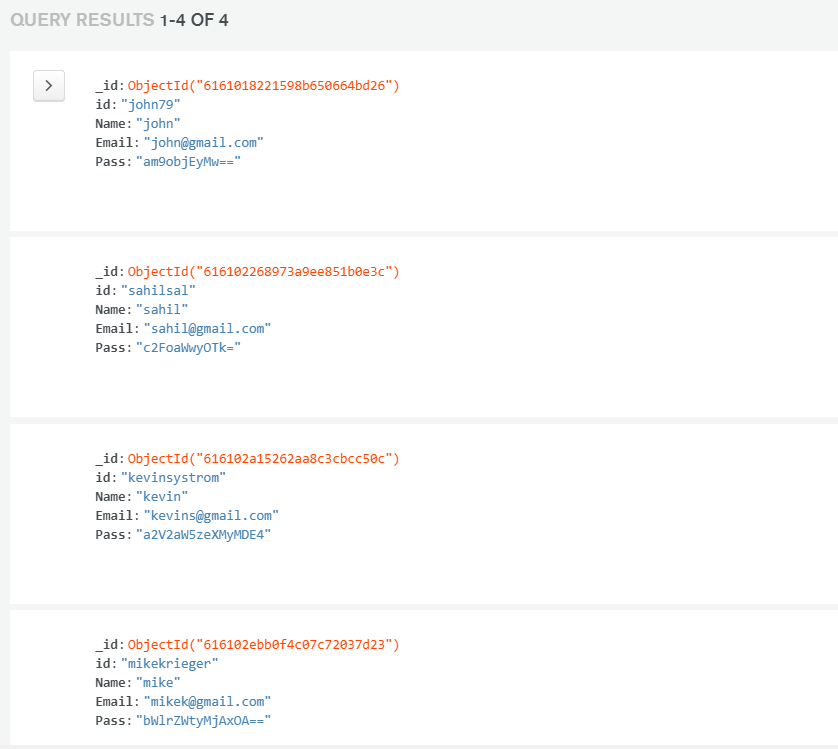
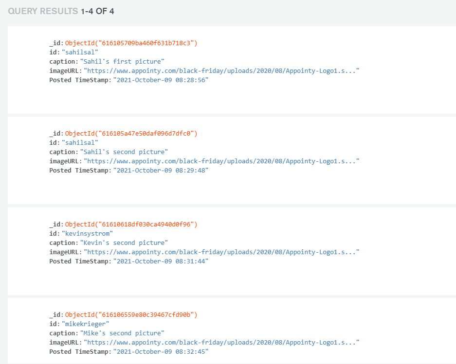

# APPOINTY-TASK

As port 1000 was free I decided to use that , 
These are the following commands for all the required functionalities:

- CREATE A NEW USER http://localhost:10000/users

- CREATE A NEW POST http://localhost:10000/posts
- 
- GET USER USING ID http://localhost:10000/users/sahilsal
- 
- GET ONE POST USING ID http://localhost:10000/posts/sahilsal
- 
- GET ALL POSTS USING ID http://localhost:10000/posts/users/sahilsal
- 

By Default I have used 'sahilsal' as the id and made it global , as I have not taken any custom input from the user.

Backend architecturee:
- user Collection 
- post Collection 

- EncodingURL-compatible base64 format for password to be more secure 
- Pagination implemented

